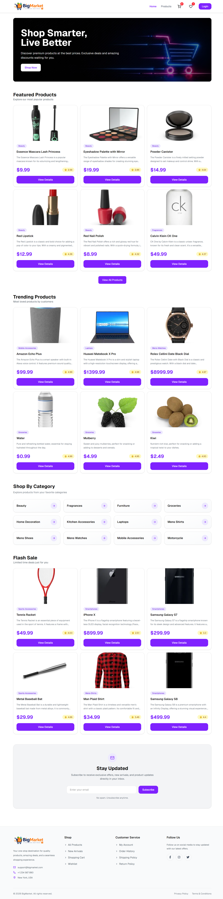
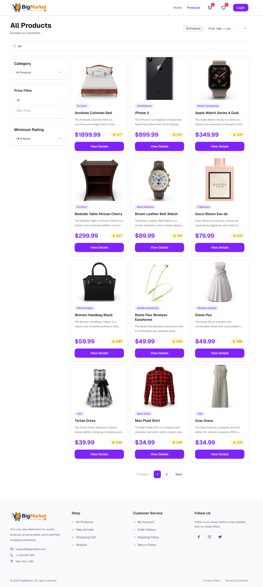
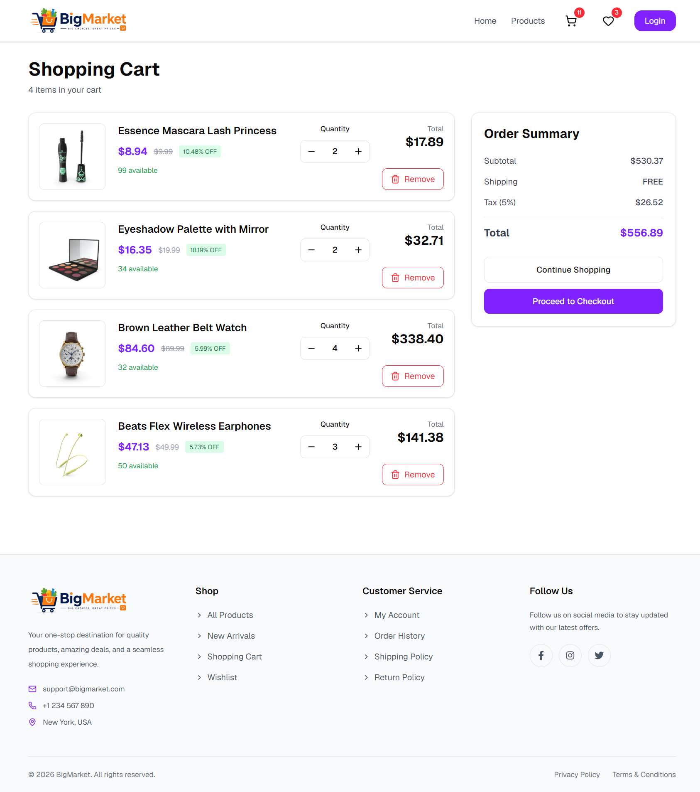

# BigMarket – Project Documentation

# 1. Project Summary

**BigMarket** is a modern, fully responsive e-commerce web application built with **React.js**. The application allows users to browse products, search and filter items, manage their shopping cart and wishlist, securely authenticate, and complete a simulated checkout process.

The project was developed as a production-style frontend application to demonstrate modern React development practices, scalable architecture, Redux Toolkit state management, reusable UI components, responsive design, and clean code organization.


## Live Demo

* **Live:** [https://bigmarkets.netlify.app/](https://bigmarkets.netlify.app/)
* **GitHub:** [https://github.com/shahbazalamjobs/bigmarket](https://github.com/shahbazalamjobs/bigmarket)


### Problem it Solves

Traditional frontend tutorials often focus only on UI implementation. BigMarket demonstrates how a complete frontend application works by integrating:

- Authentication
- API Integration
- Global State Management
- Dynamic Routing
- Filtering & Searching
- Pagination
- Cart Management
- Wishlist Management
- Checkout Flow
- Protected Routes
- Responsive UI
- Loading & Error States

---

## Preview




---

## Features

### Authentication

* Login & Logout
* Protected Routes
* Session Persistence
* User Profile

### Products

* Product Listing & Details
* Category Filtering
* Product Search
* Price & Rating Filters
* Product Sorting
* Pagination
* Skeleton Loading

### Shopping

* Shopping Cart
* Wishlist
* Checkout Flow
* Order Success Page

### User Experience

* Fully Responsive Design
* Toast Notifications
* Loading & Empty States
* Error Handling

---

## Tech Stack

### Frontend

* React 19
* JavaScript (ES6+)
* Vite

### Styling

* Tailwind CSS v4
* shadcn/ui
* Lucide React

### State Management

* Redux Toolkit
* Redux Async Thunks

### Routing

* React Router v7
* Nested & Dynamic Routes
* Protected Routes
* Lazy Loading

### API & Utilities

* Axios
* DummyJSON REST API
* Custom Hooks
* useMemo
* Debounced Search

---

## Folder Structure

```text
src
├── api
├── components
├── features
├── hooks
├── layouts
├── pages
├── routes
├── utils
└── main.jsx
```

---

## Project Architecture

```text
User
   │
   ▼
React Router
   │
   ▼
Page Component
   │
   ▼
Redux Dispatch
   │
   ▼
Async Thunk
   │
   ▼
Axios
   │
   ▼
DummyJSON API
   │
   ▼
Redux Store
   │
   ▼
UI Update
```

---

## Installation

```bash
# Clone the repository
git clone https://github.com/yourusername/bigmarket.git

# Navigate to project
cd bigmarket

# Install dependencies
npm install

# Start development server
npm run dev
```

---

## Environment Variables

```env
VITE_API_URL=https://dummyjson.com
```

---

## Key Highlights

* Feature-based scalable project architecture
* Global state management using Redux Toolkit
* Async API handling with `createAsyncThunk`
* Reusable Axios instance for API integration
* Protected routes with persistent authentication
* Dynamic routing using React Router v7
* Debounced product search
* Price, rating, and category filtering
* Pagination for efficient product browsing
* Responsive UI optimized for mobile, tablet, and desktop
* Clean, reusable, and modular component structure

---

## Performance Optimizations

* Lazy Loading with `React.lazy()` and `Suspense`
* Route-based Code Splitting
* Memoization using `useMemo`
* Debounced Search (500ms)
* Skeleton Loading Placeholders
* Conditional API Fetching
* Optimized Redux State Updates

---

## License

This project is developed for learning and portfolio purposes.

---
